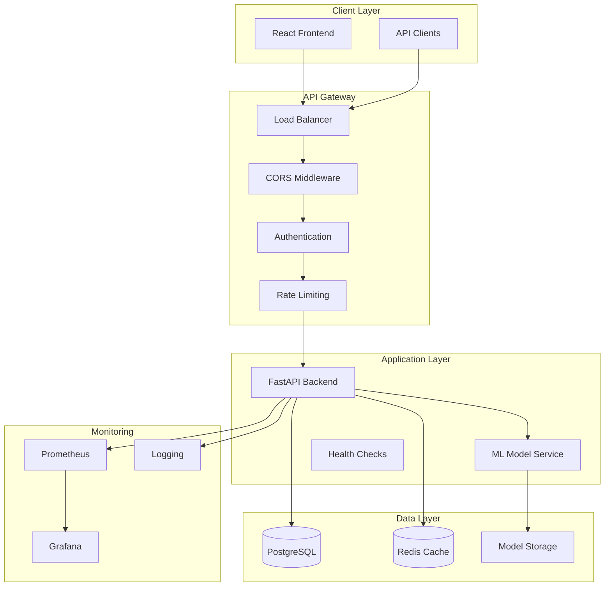
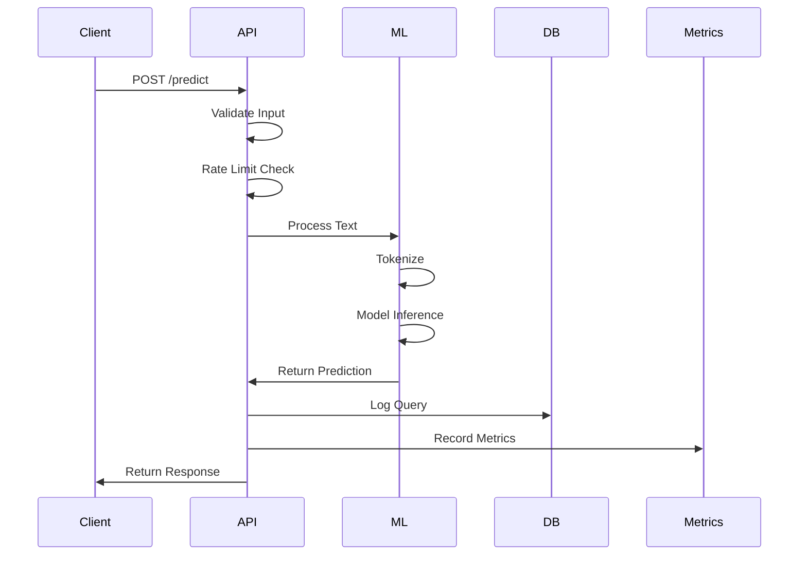
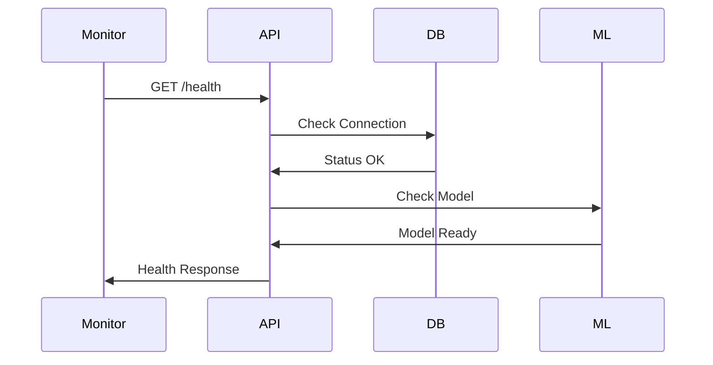

# 🏗️ System Architecture
## Medical Text Classification App

Comprehensive overview of the system architecture, design patterns, and component interactions.

## 🎯 High-Level Architecture



## 🔧 Component Architecture

### 1. Frontend Layer (React)

**Technology Stack:**
- React 18 with TypeScript
- Material-UI for components
- Axios for API communication
- React Router for navigation

**Key Components:**
```
frontend/src/
├── components/
│   ├── ClassificationForm.tsx    # Main input form
│   ├── ResultDisplay.tsx         # Prediction results
│   ├── HealthStatus.tsx          # System health
│   └── ErrorBoundary.tsx         # Error handling
├── services/
│   ├── api.ts                    # API client
│   └── types.ts                  # TypeScript definitions
├── hooks/
│   ├── useClassification.ts      # Classification logic
│   └── useHealth.ts              # Health monitoring
└── utils/
    ├── validation.ts             # Input validation
    └── formatting.ts             # Data formatting
```

**Design Patterns:**
- **Component Composition**: Reusable UI components
- **Custom Hooks**: Business logic separation
- **Error Boundaries**: Graceful error handling
- **Context API**: Global state management

### 2. Backend Layer (FastAPI)

**Technology Stack:**
- FastAPI with Pydantic validation
- Uvicorn ASGI server
- SQLAlchemy ORM
- Prometheus metrics

**Architecture Layers:**
```
src/
├── api/
│   ├── main.py                   # FastAPI application
│   ├── middleware.py             # Custom middleware
│   ├── models.py                 # Pydantic models
│   └── security.py               # Security utilities
├── ml/
│   ├── model.py                  # ML model wrapper
│   ├── inference.py              # Prediction logic
│   └── preprocessing.py          # Text preprocessing
├── db/
│   ├── __init__.py               # Database setup
│   ├── models.py                 # SQLAlchemy models
│   └── operations.py             # Database operations
└── utils/
    ├── logging.py                # Logging configuration
    └── metrics.py                # Prometheus metrics
```

**Design Patterns:**
- **Dependency Injection**: FastAPI's dependency system
- **Repository Pattern**: Database abstraction
- **Factory Pattern**: Model loading and configuration
- **Middleware Pattern**: Request/response processing

### 3. Machine Learning Pipeline

**Model Architecture:**
```
BiomedBERT Base Model
├── Tokenizer (BERT WordPiece)
├── Embedding Layer (768 dimensions)
├── Transformer Layers (12 layers)
├── Pooling Layer (CLS token)
├── Classification Head (Linear)
└── Output Layer (5 classes)
```

**Inference Pipeline:**
1. **Text Preprocessing**: Cleaning and normalization
2. **Tokenization**: BERT tokenizer with special tokens
3. **Model Inference**: Forward pass through BiomedBERT
4. **Post-processing**: Softmax and label mapping
5. **Response Formatting**: JSON response with confidence scores

**Performance Optimizations:**
- **Model Quantization**: Reduced precision for faster inference
- **Batch Processing**: Multiple requests in single forward pass
- **Caching**: Tokenizer and model caching
- **GPU Acceleration**: CUDA support when available

### 4. Data Layer

**Database Schema:**
```sql
-- User queries and predictions
CREATE TABLE medical_texts (
    id SERIAL PRIMARY KEY,
    question TEXT NOT NULL,
    answer TEXT NOT NULL,
    source VARCHAR(32),
    focusarea VARCHAR(256),
    focusgroup VARCHAR(64),
    created_at TIMESTAMP DEFAULT NOW()
);

-- API usage tracking
CREATE TABLE api_requests (
    id SERIAL PRIMARY KEY,
    endpoint VARCHAR(100),
    method VARCHAR(10),
    status_code INTEGER,
    response_time FLOAT,
    created_at TIMESTAMP DEFAULT NOW()
);

-- Security events
CREATE TABLE security_events (
    id SERIAL PRIMARY KEY,
    event_type VARCHAR(50),
    ip_address INET,
    user_agent TEXT,
    details JSONB,
    created_at TIMESTAMP DEFAULT NOW()
);
```

**Data Flow:**
1. **Input Validation**: Pydantic models validate request data
2. **Preprocessing**: Text cleaning and normalization
3. **Model Inference**: ML prediction generation
4. **Logging**: Store query and prediction for analytics
5. **Response**: Return formatted prediction results

### 5. Security Architecture

**Security Layers:**
```
Request → TrustedHost → SecurityHeaders → RequestLogging → RateLimit → CORS → Authentication → Application
```

**Security Components:**
- **Input Sanitization**: XSS and injection prevention
- **API Key Authentication**: Production access control
- **Rate Limiting**: Token bucket algorithm
- **Security Headers**: OWASP recommended headers
- **Request Logging**: Security event monitoring
- **CORS Configuration**: Cross-origin request control

**Security Patterns:**
- **Defense in Depth**: Multiple security layers
- **Principle of Least Privilege**: Minimal required permissions
- **Fail Secure**: Secure defaults and error handling
- **Security by Design**: Built-in security considerations

### 6. Monitoring & Observability

**Metrics Collection:**
```python
# Application Metrics
request_count = Counter('http_requests_total')
request_duration = Histogram('http_request_duration_seconds')
model_inference_time = Histogram('model_inference_duration_seconds')

# Business Metrics
predictions_total = Counter('predictions_total')
prediction_confidence = Histogram('prediction_confidence')
focus_group_distribution = Counter('focus_group_predictions')

# Security Metrics
rate_limit_violations = Counter('rate_limit_violations_total')
security_events = Counter('security_events_total')
api_key_failures = Counter('api_key_failures_total')
```

**Monitoring Stack:**
- **Prometheus**: Metrics collection and storage
- **Grafana**: Visualization and alerting
- **Application Logs**: Structured logging with correlation IDs
- **Health Checks**: Multi-level health monitoring

## 🔄 Data Flow Diagrams

### Request Processing Flow



### Health Check Flow



## 🏛️ Design Principles

### 1. Scalability
- **Horizontal Scaling**: Stateless application design
- **Load Balancing**: Multiple API instances
- **Database Scaling**: Connection pooling and read replicas
- **Caching Strategy**: Redis for session and model caching

### 2. Reliability
- **Circuit Breakers**: Prevent cascade failures
- **Retry Logic**: Exponential backoff for transient failures
- **Health Checks**: Proactive monitoring and alerting
- **Graceful Degradation**: Fallback mechanisms

### 3. Security
- **Zero Trust**: Verify every request
- **Encryption**: TLS in transit, encryption at rest
- **Audit Logging**: Complete request/response logging
- **Regular Updates**: Dependency and security updates

### 4. Maintainability
- **Clean Architecture**: Separation of concerns
- **Documentation**: Comprehensive API and code documentation
- **Testing**: Unit, integration, and end-to-end tests
- **Code Quality**: Linting, formatting, and type checking

### 5. Performance
- **Async Processing**: Non-blocking I/O operations
- **Connection Pooling**: Efficient database connections
- **Model Optimization**: Quantization and caching
- **CDN Integration**: Static asset delivery

## 🔧 Configuration Management

### Environment-Based Configuration
```python
class Settings:
    # Application
    environment: str = "development"
    debug: bool = False
    log_level: str = "INFO"
    
    # Database
    database_url: str
    
    # Security
    secret_key: str
    api_keys: List[str]
    
    # ML Model
    model_path: str = "models/"
    max_text_length: int = 5000
    
    # Monitoring
    enable_metrics: bool = True
    metrics_port: int = 8001
```

### Feature Flags
```python
class FeatureFlags:
    enable_api_key_auth: bool = True
    enable_rate_limiting: bool = True
    enable_request_logging: bool = True
    enable_model_caching: bool = True
    enable_database_logging: bool = True
```

## 📊 Performance Characteristics

### Latency Targets
- **API Response Time**: <200ms (95th percentile)
- **Model Inference**: <100ms per request
- **Database Queries**: <50ms average
- **Frontend Load Time**: <2s first contentful paint

### Throughput Targets
- **API Requests**: 1000+ requests/minute
- **Concurrent Users**: 100+ simultaneous users
- **Model Predictions**: 500+ predictions/minute
- **Database Operations**: 10,000+ queries/minute

### Resource Requirements
- **CPU**: 2-4 cores per API instance
- **Memory**: 2-4GB per API instance
- **Storage**: 10GB for models and data
- **Network**: 100Mbps for API traffic

## 🚀 Deployment Architecture

### Container Architecture
```dockerfile
# Multi-stage build
FROM python:3.12-slim as builder
# Build dependencies and virtual environment

FROM python:3.12-slim as runtime
# Copy built environment and application code
# Run as non-root user
```

### Orchestration (Kubernetes)
```yaml
# Deployment with multiple replicas
# Horizontal Pod Autoscaler
# Service mesh for communication
# Ingress for external access
```

---

## 🎯 Architecture Benefits

### 1. **Modularity**: Each component has a single responsibility
### 2. **Testability**: Clear interfaces enable comprehensive testing
### 3. **Scalability**: Horizontal scaling at each layer
### 4. **Maintainability**: Clean separation of concerns
### 5. **Security**: Defense in depth with multiple security layers
### 6. **Observability**: Comprehensive monitoring and logging
### 7. **Performance**: Optimized for low latency and high throughput

This architecture provides a solid foundation for a production-grade medical text classification system that can scale, perform reliably, and maintain security standards.
